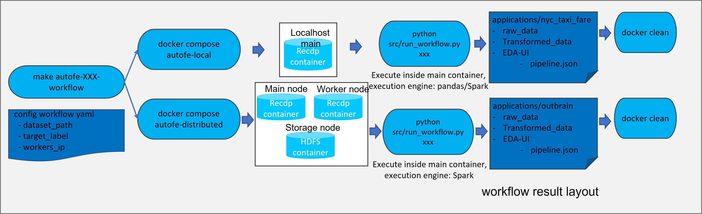
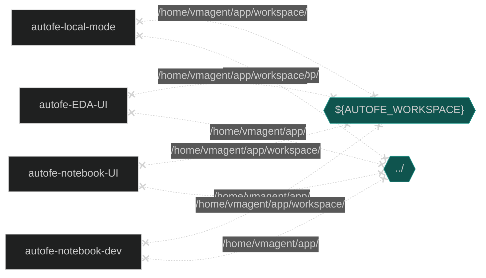
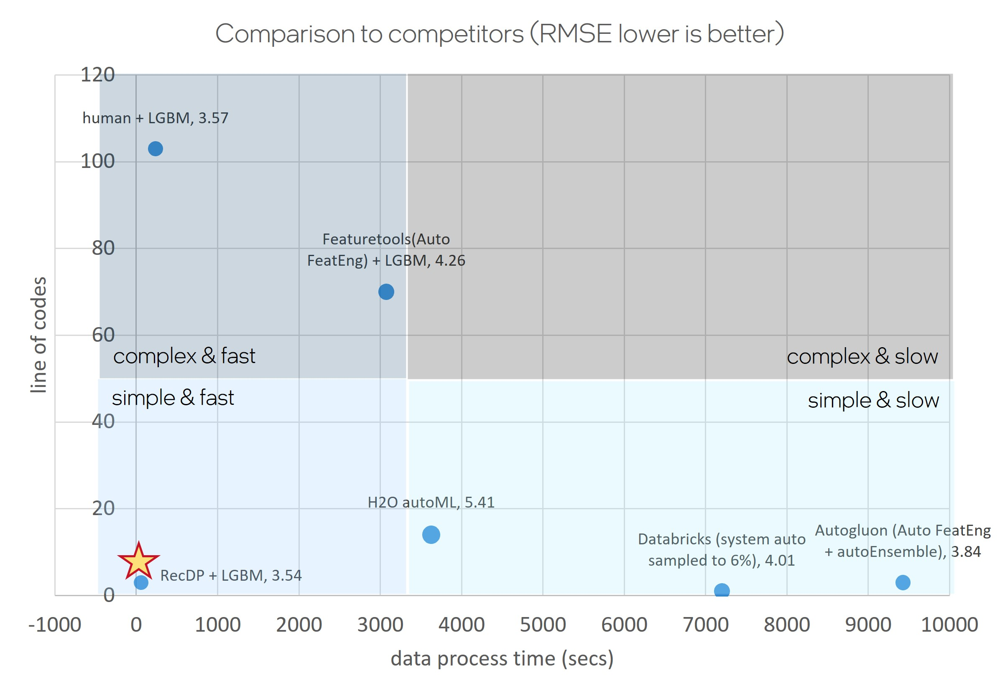

# Auto Feature Engineering Workflow

## Introduction
Auto Feature Engineering helps to shorten the time required for data scientists to process and transform large-scale raw tabular datasets to ready-to-train features, reducing the necessity of human domain-specific knowledge to explore and identify new useful features, and thus enabling data scientists to be able to focus and iterate on the rest stages of the E2E AI pipelines more efficiently. 

The workflow leverages [Intel Auto-Feature-Engineering toolkit (codename: RecDP)](https://github.com/intel/e2eAIOK/tree/main/RecDP) to automatically transform raw tabular data to enriched useful new features on pluggable execution engine such as Pandas and Spark, with the capability of integrating 3rd party feature engineering primitives, and thus significantly improve developer productivity and efficiency.


Check out more workflow examples in the [Developer Catalog](https://developer.intel.com/aireferenceimplementations).

## Solution Technical Overview

Auto feature engineering targets to simplify Feature engineering process with enhanced performance via parallel data processing frameworks, automated data processing pipeline and built-in domain-specific feature engineering primitives. This repository provides an end-to-end workflow that automatically analyzes the data based on data type, profiles feature distribution, generates customizable feature engineering pipelines for the data preparation and executes the pipeline parallelly with different backend engines on Intel platform.

This workflow leverages the RecDP toolkits from [Intel® End-to-End AI Optimization kit](https://github.com/intel/e2eAIOK) and the features can be used by both ML and DL models. 

## Solution Technical Details


Steps explained:
1. Feature profile: Analyze raw tabular dataset to infer original feature based on data type and generate FeatureList.
2. Feature engineering: Use inferred FeatureList to generate Data Pipeline in Json/Yaml File format.
3. Feature transformation: Convert Data Pipeline to executable operations and transform original features to candidate features with selected engine, currently Pandas and Spark were supported.
4. Feature Importance Estimator: perform feature importance analysis on candidate features to remove un-important features, generate the transfomred dataset that includes all finalize features that will be used for training. 


## Validated Hardware Details

There are workflow-specific hardware and software setup requirements depending on how the workflow is run.

### Hardware Requirements

| Name            | Description                          |
| --------------- | ------------------------------------ |
| CPU             | Intel® 1st, 2nd, 3rd, and 4th Gen Xeon® Scalable Performance processors |
| Memory Size     | >100 GB                              |
| Disk Size       | >300 GB                              |
| Docker Version  | 23.0.x                               |

### Software Requirements

| Package         | Version                              |
| --------------- | ------------------------------------ |
| Python          | 3.8.10                               |
| Spark           | 3.3.1                                |
| Pandas          | 2.0.1                                |

This workflow has been validated with Ubuntu 20.04 OS. 

## How it Works

This Auto Feature Engineering Workflow loads tabular data, profiles data, applies feature transformation, generates new features to enrich the features, and then evaluates performance with transformed data. The whole process is configurable using yaml configuration file including tabular data path, target label of tabular data and execution engine. 

## Get Started

Start by defining an environment variable that will store the workspace path, this can be an existing directory or one to be created in further steps. This ENVVAR will be used for all the commands executed using absolute paths.

```bash
export WORKSPACE=~/work
```

### Workflow Overview



Steps explained: 
1. Download suggested dataset. (Skip if you want to use own dataset).
2. Create a folder in applications and put the dataset there.
3. Create a workflow yaml file in {your folder} to config dataset_path and label.
4. run "docker compose run autofe-local-mode" (cmdline mode) or run "docker compose run autofe-notebook-UI" (jupyter notebook mode).
5. Once the script completes successfully, you'll see transformed data and EDA analysis in {your folder}. 

Following steps is a auto feature engineering example on [NYC taxi dataset](https://www.kaggle.com/competitions/new-york-city-taxi-fare-prediction/data).

### Download the Workflow Repository

Create a working directory for workflow and clone workflow repo into working directory.
```
mkdir -p $WORKSPACE && cd $WORKSPACE
git clone https://github.com/intel/auto-feature-engineering.git
export AUTOFE_DIR=`pwd`/auto-feature-engineering
```

### Download the Dataset

The examples uses [kaggle API](https://github.com/Kaggle/kaggle-api) to download dataset, you can also download [dataset](https://www.kaggle.com/competitions/new-york-city-taxi-fare-prediction/data) manually. 
```
pip install kaggle==1.5.3
apt install unzip

export KAGGLE_USERNAME=${your_kaggle_username}
export KAGGLE_KEY=${your_kaggle_key}
export KAGGLE_PROXY=${your_proxy}

# download NYC taxi dataset, usually took ~2 mins
cd ${AUTOFE_DIR}/applications/nyc_taxi_fare/; mkdir -p raw_data; cd raw_data;
kaggle competitions download -c new-york-city-taxi-fare-prediction; unzip new-york-city-taxi-fare-prediction.zip
```

## Supported Runtime Environment
You can execute the references pipelines using the following environments:
* Docker
* Argo
* Jupyter

### Run Using Docker
Follow these instructions to set up and run our provided Docker image.

#### Set Up Docker Engine
You'll need to install Docker Engine on your development system. Note that while **Docker Engine** is free to use, **Docker Desktop** may require you to purchase a license.  See the [Docker Engine Server installation instructions](https://docs.docker.com/engine/install/#server) for details.

If the Docker image is run on a cloud service, you may also need credentials to perform training and inference related operations (such as these
for Azure):
- [Set up the Azure Machine Learning Account](https://azure.microsoft.com/en-us/free/machine-learning)
- [Configure the Azure credentials using the Command-Line Interface](https://docs.microsoft.com/en-us/cli/azure/authenticate-azure-cli)
- [Compute targets in Azure Machine Learning](https://learn.microsoft.com/en-us/azure/machine-learning/concept-compute-target)
- [Virtual Machine Products Available in Your Region](https://azure.microsoft.com/en-us/explore/global-infrastructure/products-by-region/?products=virtual-machines&regions=us-east)

#### Setup Docker Compose
Ensure you have Docker Compose installed on your machine. If you don't have this tool installed, consult the official [Docker Compose installation documentation](https://docs.docker.com/compose/install/linux/#install-the-plugin-manually).

```bash
DOCKER_CONFIG=${DOCKER_CONFIG:-$HOME/.docker}
mkdir -p $DOCKER_CONFIG/cli-plugins
curl -SL https://github.com/docker/compose/releases/download/v2.7.0/docker-compose-linux-x86_64 -o $DOCKER_CONFIG/cli-plugins/docker-compose
chmod +x $DOCKER_CONFIG/cli-plugins/docker-compose
docker compose version
```

#### Set Up Docker Image
Build or pull the provided docker image.

```bash 
cd $AUTOFE_DIR/docker
docker compose build
```
Or
```bash
docker pull intel/ai-workflows:pa-autofe
```

#### Run Pipeline with Docker Compose 
This command will build RecDP docker image and starts docker container. `$AUTOFE_WORKSPACE` directory will be mounted to docker container and corresponding workflow will be launched in container. When the command completes successfully, a `EDA` folder will be created under $workspace folder, containing transformed dataset and `pipeline.json` file that contains feature transform pipeline created by RecDP.
> Note: We use system proxy from host while building docker image, so please set correct environment param for `http_proxy` and `https_proxy` in host.



The table below shows some of the environment variables you can control according to your needs.
| Environment Variable Name | Default Value | Description |
| --- | --- | --- |
| AUTOFE_WORKSPACE | `${AUTOFE_DIR}/applications/nyc_taxi_fare` | Workflow workspace directory, will be mounted to `/home/vmagent/app/workspace/` |

Configuration for ${AUTOFE_DIR}/applications/nyc_taxi_fare/workflow.yaml
``` yaml
dataset_path: ./raw_data/train.csv
target_label: fare_amount
engine_type: spark
```

``` bash
cd ${AUTOFE_DIR}/docker
export AUTOFE_WORKSPACE=${AUTOFE_DIR}/applications/nyc_taxi_fare
docker compose run autofe-local-mode
```

#### Expected Output:
* Docker container will be built and started
* Configuration file is parsed and input
```
autofe_pyrecdp  | Configuration is {'dataset_path': './raw_data/train.csv', 'target_label': 'fare_amount'}
```

* Workflow profiles input data and creates data pipeline automatically.
```
autofe_pyrecdp  | {0: DataFrame, 1: type_infer, 2: astype, 3: fillna, 4: DataFrame, 5: type_infer, 6: tuple, 7: tuple, 8: astype, 9: fillna, 10: astype, 11: datetime_featur
e, 12: haversine, 13: drop}
```

* Workflow starts to transform data, we provided engine in configuration: pandas and spark
```
autofe_pyrecdp  | execute with spark started ...
...

autofe_pyrecdp  | execute drop started ...
autofe_pyrecdp  |   execute drop took 0.0009502819739282131 sec
autofe_pyrecdp  | DataframeTransform took 83.058 secs, processed 55423856 rows with num_partitions as 200
autofe_pyrecdp  | DataframeTransform combine to one pandas dataframe took 4.765 secs
autofe_pyrecdp  | execute with spark took 151.22523793019354 sec
```

* Workflow completed!
```
autofe_pyrecdp  | ************ Completed! ************
autofe_pyrecdp  | original data shape is (55423856, 8), after transformed data shape is (55423856, 17)
autofe_pyrecdp  | Transformed Data and EDA analysis are saved in your workspace
autofe_pyrecdp  |       transformed_data.parquet
autofe_pyrecdp  |       workflow.yaml
autofe_pyrecdp  |       EDA
autofe_pyrecdp  |       raw_data
autofe_pyrecdp  | EDA folder:
autofe_pyrecdp  |       UI_notebook.ipynb
autofe_pyrecdp  |       pipeline.json
autofe_pyrecdp  |       transformed_data_sample.csv
autofe_pyrecdp  |       original_data_sample.csv
autofe_pyrecdp  |       .ipynb_checkpoints
autofe_pyrecdp  | Please visit EDA/UI_notebook.ipynb for details
autofe_pyrecdp  | **************************************
autofe_pyrecdp  |
autofe_pyrecdp exited with code 0
```

#### Clean Up Docker Containers
Stop containers created by docker compose and remove them.

```bash
docker compose down
```

### Run Using Argo
#### 1. Install Helm
- Install [Helm](https://helm.sh/docs/intro/install/)
```bash
curl -fsSL -o get_helm.sh https://raw.githubusercontent.com/helm/helm/main/scripts/get-helm-3 && \
chmod 700 get_helm.sh && \
./get_helm.sh
```
#### 2. Setting up K8s
- Install [Argo Workflows](https://argoproj.github.io/argo-workflows/quick-start/) and [Argo CLI](https://github.com/argoproj/argo-workflows/releases)
- Configure your [Artifact Repository](https://argoproj.github.io/argo-workflows/configure-artifact-repository/)
- Ensure that your dataset and config files are present in your chosen artifact repository.
#### 3. Install Workflow Template
```bash
export NAMESPACE=argo
helm install --namespace ${NAMESPACE} --set proxy=${http_proxy} auto-feature-engineering ./chart
argo submit --from wftmpl/auto-feature-engineering --namespace=${NAMESPACE}
```
#### 4. View 
To view your workflow progress
```bash
argo logs @latest -f
```

### Run Using Jupyter
We setup Jupyter environment in docker image, so please follow [Set Up Docker Engine](#set-up-docker-engine) and [Setup Docker Compose](#setup-docker-compose) to install Docker Engine and Docker Compose first.

#### Set Up Docker Image
Build or pull the provided docker image.

```bash 
cd $AUTOFE_DIR/docker
docker compose build
```
Or
```bash
docker pull intel/ai-workflows:pa-autofe
```

#### Run Pipeline with Jupyter
This command will build RecDP docker image and starts docker container. `$AUTOFE_WORKSPACE` directory will be mounted to docker container and corresponding workflow will be launched in container. When the command completes successfully, a `EDA` folder will be created under $workspace folder, containing transformed dataset and `pipeline.json` file that contains feature transform pipeline created by RecDP.
> Note: We use system proxy from host while building docker image, so please set correct environment param for `http_proxy` and `https_proxy` in host.

Configuration for ${AUTOFE_DIR}/applications/nyc_taxi_fare/workflow.yaml
``` yaml
dataset_path: ./raw_data/train.csv
target_label: fare_amount
engine_type: spark
```

``` bash
cd ${AUTOFE_DIR}/docker
export AUTOFE_WORKSPACE=${AUTOFE_DIR}/applications/nyc_taxi_fare
docker compose run autofe-notebook-UI
```

#### Expected Output: 
* Docker container will be built and started
* Then you can follow the instruction to open notebook on http://{host}:{port}/lab/tree/interactive_notebook.ipynb
```
[+] Building 2.9s (10/10) FINISHED
 => [internal] load build definition from Dockerfile-recdp                                                                                                             0.0s
 ...
 ⠿ Container autofe_pyrecdp  Created                                                                                                                                   0.0s
Attaching to autofe_pyrecdp
...
autofe_notebook_UI  | [I 2023-05-15 15:48:10.346 ServerApp] Jupyter Server 2.5.0 is running at:
autofe_notebook_UI  | [I 2023-05-15 15:48:10.346 ServerApp] http://{host}:8890/lab
autofe_notebook_UI  | [I 2023-05-15 15:48:10.346 ServerApp]     http://127.0.0.1:8890/lab
autofe_notebook_UI  | [I 2023-05-15 15:48:10.346 ServerApp] Use Control-C to stop this server and shut down all kernels (twice to skip confirmation).
```

### Built-In Use Cases

| Workflow Name | Description |
| --- | --- |
| [NYC taxi fare](applications/nyc_taxi_fare/interactive_notebook.ipynb) | Fare prediction based on NYC taxi dataset |
| [Amazon Product Review](applications/amazon_product_review/interactive_notebook.ipynb) | Product recommandation based on reviews from Amazon |
| [IBM Card Transaction Fraud Detect](applications/fraud_detect/interactive_notebook.ipynb) | Recognize fraudulent credit card transactions |
| [Twitter Recsys](applications/twitter_recsys/interactive_notebook.ipynb) | Real-world task of tweet engagement prediction |
| [Outbrain](applications/outbrain_ctr/interactive_notebook.ipynb) | Click prediction for recommendation system |
| [CDP Tabular Utils](applications/cdp_tabular_utils/interactive_notebook.ipynb) | integration example with CDP Tabular Utils |
| [PredictiveAssetsMaintenance](applications/predictive_assets_maintenance/interactive_notebook.ipynb) | integration example with predictive assets maintenance use case |

## How to Customize this Workflow

### 1. Prepare Your Own Dataset

Create a workflow directory like `mkdir -p ${AUTOFE_DIR}/applications/customer_dataset/raw_data` and put your dataset under `raw_data` directory.

### 2. Create Your workflow.yaml Configuration

* Create workflow configuration yaml file `${AUTOFE_DIR}/applications/customer_dataset/workflow.yaml`
* Add workflow configurations in workflow.yaml, supported configurations are listed in the table

| Name            | Description   |
| --------------- | ------------- |
| dataset_path | set dataset directory |
| target_label | specify target lable of dataset |
| engine_type | config auto feature engineering engine type, support pandas and spark |

* Example configuration of NYC taxi dataset:
``` yaml
dataset_path: ./raw_data/train.csv
target_label: fare_amount
engine_type: spark
```

### 3. Run the Workflow

Pick either jupyter mode or docker cmdline mode to run the workflow. 

#### Option 1: Jupyter Mode
``` bash
cd ${AUTOFE_DIR}/docker
export AUTOFE_WORKSPACE=${AUTOFE_DIR}/applications/customer_dataset
docker compose run autofe-notebook-UI
```

#### Option 2: Docker Cmdline Mode
``` bash
cd ${AUTOFE_DIR}/docker
export AUTOFE_WORKSPACE=${AUTOFE_DIR}/applications/customer_dataset
docker compose run autofe-local-mode
```

## Performance Overview


AutoFE workflows significantly simplifies the complexity of feature engineering with just 3 lines of code, and reduced data process time.
> Note: The performance data is tested on single node with 3rd Gen Xeon® Scalable Performance processors with Spark as execution engine. 

## Learn More
For more information about or to read about other relevant workflow examples, see these guides and software resources:
* [RecDP toolkit](https://github.com/intel/e2eAIOK/tree/main/RecDP)
* [Intel® End-to-End AI Optimization kit](https://github.com/intel/e2eAIOK)
* [Intel® AI Analytics Toolkit (AI Kit)](https://www.intel.com/content/www/us/en/developer/tools/oneapi/ai-analytics-toolkit.html)

## Support
If you have questions or issues about this workflow, contact the [Support Team](support_forum_link).
If there is no support forum, and we want developers to use GitHub issues to submit bugs and enhancement requests, put a link to that GitHub repo's issues.

The Auto Feature Engineering Workflow team tracks both bugs and enhancement requests using [GitHub issues](https://github.com/intel/auto-feature-engineering/issues). Before submitting a suggestion or bug report, search the [DLSA GitHub issues](https://github.com/intel/document-level-sentiment-analysis/issues) to see if your issue has already been reported.

---

\*Other names and brands may be claimed as the property of others.
[Trademarks](https://www.intel.com/content/www/us/en/legal/trademarks.html).
